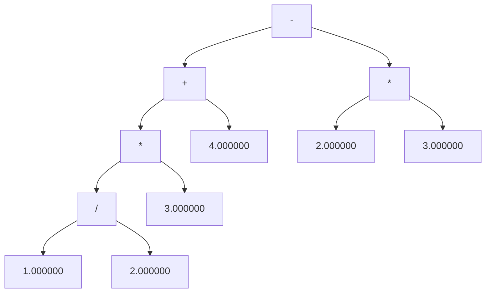

```mermaid
graph TD;
0x55d4479c5630["-"]-->0x55d4479c54f0["+"];
0x55d4479c54f0["+"]-->0x55d4479c5450["*"];
0x55d4479c5450["*"]-->0x55d4479c53b0["/"];
0x55d4479c53b0["/"]-->0x55d4479c5310["1.000000"];
0x55d4479c53b0["/"]-->0x55d4479c5360["2.000000"];
0x55d4479c5450["*"]-->0x55d4479c5400["3.000000"];
0x55d4479c54f0["+"]-->0x55d4479c54a0["4.000000"];
0x55d4479c5630["-"]-->0x55d4479c55e0["*"];
0x55d4479c55e0["*"]-->0x55d4479c5540["2.000000"];
0x55d4479c55e0["*"]-->0x55d4479c5590["3.000000"];
```
