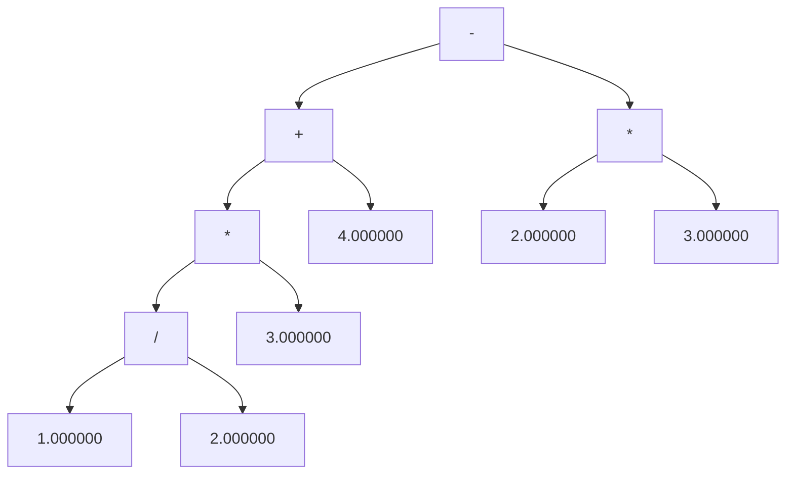
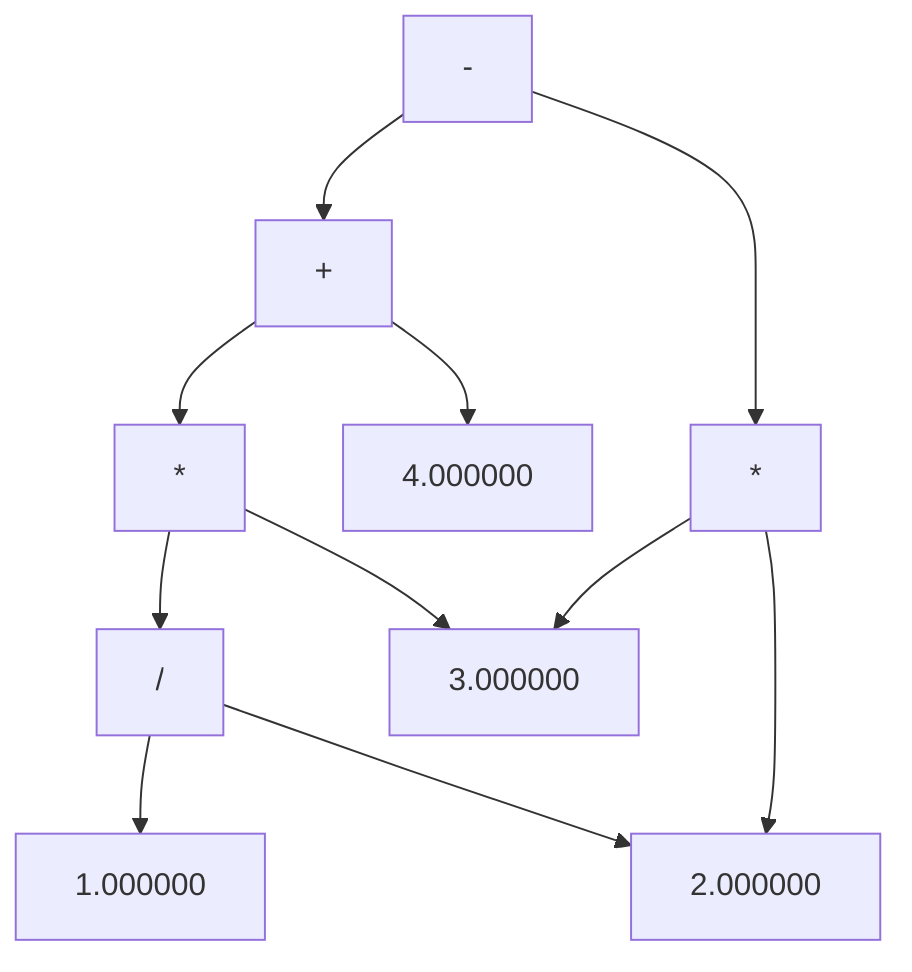

<h1 align = "center"> Compiler Intermediate Representation </h1>
A compiler can be divided into two main phases based on how they process code.

The front-end, or analysis phase, of the compiler reads the source code, breaks it down into its essential components, and checks for lexical, grammar, and syntax errors. During this analysis phase, an intermediate code representation of the source code and a symbol table are generated. These outputs serve as input for the back-end of the compiler.

In the ***analysis-synthesis*** model of a compiler, the front-end first translates a source program into an independent intermediate code. Then, the back-end of the compiler utilizes this intermediate code to produce the target code that can be executed by the machine. The use of an intermediate representation is necessary because compilers typically cannot directly generate machine code in a single pass. Therefore, the source program is initially converted into an intermediate code, which is more efficient for the subsequent generation of machine code. This intermediate code can take the form of 3-address code, Abstract Syntax Trees, or Directed Acyclic Graphs.

<h2 id="usage"> Usage Instructions </h2>

Note: Every folder comprises of seperate .y and .l files for respective tasks. 

1. Input files: `input.txt`
2. Compile the `parse.y` program using `yacc parse.y -d`. The result of the compilation are these two files - `y.tab.h` and `y.tab.c`.
3. Compile the `lex.l` program using `lex tokenizer.l`.
4. Compile `parse.tab.c` using `g++ parse.tab.c -o parser`
5. Execute the parser using `./parser.out`

Note: We will consider grammar for a simple calculator supporting operations like addition, subtraction, multiplication and division for the above mentioned Intermediate Code Generators.


<h2 id="usage"> Abstract Syntax Tree </h2>

``Language Support:``  The attribute grammar to generate the AST, using the semantic actions, is given as -  

```
S -> E (inorderTraversal(E.node))

E -> E1 + T  (E.node = new Node('+', E1.node, T.node, E1.val + T.val))
E -> E1 - T  (E.node = new Node('-', E1.node, T.node, E1.val - T.val))
E -> T (E.node = T.node)

T -> T1 * F (T.node = new Node('*', T1.node, F.node, T1.val * F.val))
T -> T1 / F (T.node = new Node('/', T1.node, F.node, T1.val / F.val))  
T -> F (T.node = F.node)

F -> FLOATCONST (F.node = new Node(FLOATCONST.floatValue))
```

``Structure of node:``

```
class Node{
public:
Node *left = NULL, *right = NULL;
double val = 0;
char type;
};
```

``Explantion:`` For every float constant encountered, we make a leaf node. We pass that node to the non-terminal parent. For every symbol expression like E+T, we make a node with + as parent and nodes from E and T as left and right children. An abstract syntax tree (AST) is very similar to parse tree where extraneous nodes are removed (nodes for most non-terminal symbols removed). We recursively make the tree up the parse tree.

***Sample Input***

```
1 / 2 * 3 + 4 - 2 * 3
```

***Sample Output(Terminal)***
```
Evaluation Result: -0.5
Entered arithmetic expression is Valid.
```

***Sample Output(AST Graph)***



<h2 id="usage"> Directed Acyclic Graph </h2>

``Language Support:``  The attribute grammar to generate the DAG, using the semantic actions, is given as -  

```
S -> E (inorderTraversal(E.node))

E -> E1 + T  {
    Node* node = searchNodeInSymbolTable("+", E1.node, T.node);
    if(node == NULL) {
        string sa = to_string((long long)E1.node);
        string sb = to_string((long long)T.node);

        string s = "+" + sa + sb;
        Node* temp = new Node(1, E1.node, T.node, E1.val + T.val, s);
        E.node = temp;
        SymbolTable[s] = temp;
    } else {
        E.node = node;
    }
}  ----> SA_1
E -> E1 - T  {Same as SA_1 with operator changed}
E -> T (E.node = T.node)

T -> T1 * F {Same as SA_1 with operator changed}
T -> T1 / F {Same as SA_1 with operator changed}
T -> F (T.node = F.node)

F-> FLOATCONST 
{
    string constant = to_string(FLOATCONST.val);
    if(m.find(constant) != m.end()) {
        F.node = m[constant];
    } 
    else {
        Node* temp = new Node(constant, $<value>1);
        SymbolTable[constant] = temp;
        F.node = temp;
    }
}
```

``Structure of node:``

```
class Node{
public:
Node *left = NULL, *right = NULL;
double val = 0;
char type;
string uniqueID;
};
```

***Sample Input***

```
1 / 2 * 3 + 4 - 2 * 3
```

***Sample Output(Terminal)***
```
Formed String Key: /9442046359630494420463596560
Formed String Key: *9442046359779294420463597984
Formed String Key: +9442046359812894420463598320
Formed String Key: *9442046359656094420463597984
Formed String Key: -9442046359846494420463598656
Evaluation Result: -0.5

Entered arithmetic expression is Valid.
```

***Sample Output(AST Graph)***



<h2 id="usage"> 3-Address Code </h2>

``Language Support:``  The attribute grammar to generate the 3-address code, using the semantic actions, is given as -  

```
E -> E1 + T {
string id = genSymbol();
E.symbol = id;
output += id + " = " + E1.symbol + " + " + T.symbol + "\n";
}
E -> E1 - T {
string id = genSymbol();
E.symbol = id;
output += id + " = " + E1.symbol + " - " + T.symbol + "\n";
}
E -> T {
E.symbol = T.symbol;
}
T -> T1 * F {
string id = genSymbol();
T.symbol = id;
output += id + " = " + T1.symbol + " * " + F.symbol + "\n";
}
T -> T1 / F {
string id = genSymbol();
T.symbol = id;
output += id + " = " + T1.symbol + " / " + F.symbol + "\n";
}
T -> F {
T.node = F.node
}
F -> number {
F.symbol = to_string(number);
}
```

``Explantion:`` Every node is assigned a symbol. For a number, the symbol is basically its
value in string format. Whenever branching (due to operators) is seen, a new symbol is created and new symbol is made equal to the result of the operation (added to the output code) and new symbol is returned as id for the parent. Basically, every operation returns a symbol which is equal to the result of the operation.

***Sample Input***

```
1 / 2 * 3 + 4 - 2 * 3
```

***Sample Output***

```
t0 = 1.000000 / 2.000000
t1 = t0 * 3.000000
t2 = t1 + 4.000000
t3 = 2.000000 * 3.000000
t4 = t2 - t3
Evaluation Result: -0.5
Entered arithmetic expression is Valid.
```

<h2 id="usage"> GCC Intermediate Codes </h2>

``Sample Code``

```
#include <stdio.h>
int main() {
    // code by Akshat Rampuria
    int x=1;
    while(x<10) x++;
    printf("%d \n", x);
    printf("Analysing by Akshat\n");
    return 0;
}
```

### Abstract Syntax Tree: 
```
gcc test.c -fdump-tree-original-raw
```

Output: 

```
;; Function main (null)
;; enabled by -tree-original

@1      statement_list   0   : @2       1   : @3      
@2      bind_expr        type: @4       vars: @5       body: @6      
@3      return_expr      type: @4       expr: @7      
@4      void_type        name: @8       algn: 8       
@5      var_decl         name: @9       type: @10      scpe: @11     
                         srcp: sample.c:4              init: @12     
                         size: @13      algn: 32       used: 1       
@6      statement_list   0   : @14      1   : @15      2   : @16     
                         3   : @17      4   : @18      5   : @19     
                         6   : @20      7   : @21      8   : @22     
                         9   : @23     
@7      modify_expr      type: @10      op 0: @24      op 1: @25     
@8      type_decl        name: @26      type: @4      
@9      identifier_node  strg: x        lngt: 1       
@10     integer_type     name: @27      size: @13      algn: 32      
                         prec: 32       sign: signed   min : @28     
                         max : @29     
@11     function_decl    name: @30      type: @31      srcp: sample.c:2      
                         link: extern  
@12     integer_cst      type: @10     int: 1
@13     integer_cst      type: @32     int: 32
@14     decl_expr        type: @4      
@15     goto_expr        type: @4       labl: @33     
@16     label_expr       type: @4       name: @34     
@17     postincrement_expr type: @10      op 0: @5       op 1: @12     
@18     label_expr       type: @4       name: @33     
@19     cond_expr        type: @4       op 0: @35      op 1: @36     
                         op 2: @37     
@20     label_expr       type: @4       name: @38     
@21     call_expr        type: @10      fn  : @39      0   : @40     
                         1   : @5      
@22     call_expr        type: @10      fn  : @41      0   : @42     
@23     return_expr      type: @4       expr: @43     
@24     result_decl      type: @10      scpe: @11      srcp: sample.c:2      
                         note: artificial              size: @13     
                         algn: 32      
@25     integer_cst      type: @10     int: 0
@26     identifier_node  strg: void     lngt: 4       
@27     type_decl        name: @44      type: @10     
@28     integer_cst      type: @10     int: -2147483648
@29     integer_cst      type: @10     int: 2147483647
@30     identifier_node  strg: main     lngt: 4       
@31     function_type    unql: @45      size: @46      algn: 8       
                         retn: @10     
@32     integer_type     name: @47      size: @48      algn: 128     
                         prec: 128      sign: unsigned min : @49     
                         max : @50     
@33     label_decl       type: @4       scpe: @11      note: artificial 
@34     label_decl       type: @4       scpe: @11      note: artificial 
@35     le_expr          type: @10      op 0: @5       op 1: @51     
@36     goto_expr        type: @4       labl: @34     
@37     goto_expr        type: @4       labl: @38     
@38     label_decl       type: @4       scpe: @11      note: artificial 
@39     addr_expr        type: @52      op 0: @53     
@40     nop_expr         type: @54      op 0: @55     
@41     addr_expr        type: @52      op 0: @53     
@42     nop_expr         type: @54      op 0: @56     
@43     modify_expr      type: @10      op 0: @24      op 1: @25     
@44     identifier_node  strg: int      lngt: 3       
@45     function_type    size: @46      algn: 8        retn: @10     
@46     integer_cst      type: @32     int: 8
@47     identifier_node  strg: bitsizetype             lngt: 11      
@48     integer_cst      type: @32     int: 128
@49     integer_cst      type: @32     int: 0
@50     integer_cst      type: @32     int: -1
@51     integer_cst      type: @10     int: 9
@52     pointer_type     size: @57      algn: 64       ptd : @58     
@53     function_decl    name: @59      type: @58      srcp: stdio.h:332    
                         args: @60      body: undefined 
                         link: extern  
@54     pointer_type     qual:   r      unql: @61      size: @57     
                         algn: 64       ptd : @62     
@55     addr_expr        type: @63      op 0: @64     
@56     addr_expr        type: @65      op 0: @66     
@57     integer_cst      type: @32     int: 64
@58     function_type    size: @46      algn: 8        retn: @10     
                         prms: @67     
@59     identifier_node  strg: printf   lngt: 6       
@60     parm_decl        name: @68      type: @54      srcp: stdio.h:332    
                         argt: @54      size: @57      algn: 64      
                         used: 0       
@61     pointer_type     size: @57      algn: 64       ptd : @62     
@62     integer_type     qual: c        name: @69      unql: @70     
                         size: @46      algn: 8        prec: 8       
                         sign: signed   min : @71      max : @72     
@63     pointer_type     size: @57      algn: 64       ptd : @73     
@64     string_cst       type: @73     strg: %d 
     lngt: 5       
@65     pointer_type     size: @57      algn: 64       ptd : @74     
@66     string_cst       type: @74     strg: Analysing by Akshat
  lngt: 21      
@67     tree_list        valu: @54     
@68     identifier_node  strg: __format lngt: 8       
@69     type_decl        name: @75      type: @70     
@70     integer_type     name: @69      size: @46      algn: 8       
                         prec: 8        sign: signed   min : @71     
                         max : @72     
@71     integer_cst      type: @70     int: -128
@72     integer_cst      type: @70     int: 127
@73     array_type       size: @76      algn: 8        elts: @70     
                         domn: @77     
@74     array_type       size: @78      algn: 8        elts: @70     
                         domn: @79     
@75     identifier_node  strg: char     lngt: 4       
@76     integer_cst      type: @32     int: 40
@77     integer_type     size: @57      algn: 64       prec: 64      
                         sign: signed   min : @80      max : @81     
@78     integer_cst      type: @32     int: 168
@79     integer_type     size: @57      algn: 64       prec: 64      
                         sign: signed   min : @80      max : @82     
@80     integer_cst      type: @83     int: 0
@81     integer_cst      type: @83     int: 4
@82     integer_cst      type: @83     int: 20
@83     integer_type     name: @84      size: @57      algn: 64      
                         prec: 64       sign: unsigned min : @80     
                         max : @85     
@84     identifier_node  strg: sizetype lngt: 8       
@85     integer_cst      type: @83     int: -1
```

### GNU SIMPLE representation (GIMPLE):
```
gcc test.c -fdump-tree-gimple-raw
```

Output:

```
main ()
gimple_bind <
  int D.2320;

  gimple_bind <
    int x;

    gimple_assign <integer_cst, x, 1, NULL, NULL>
    gimple_goto <<D.2317>>
    gimple_label <<D.2316>>
    gimple_assign <plus_expr, x, x, 1, NULL>
    gimple_label <<D.2317>>
    gimple_cond <le_expr, x, 9, <D.2316>, <D.2318>>
    gimple_label <<D.2318>>
    gimple_call <printf, NULL, "%d \n", x>
    gimple_call <printf, NULL, "Analysing by Akshat\n">
    gimple_assign <integer_cst, D.2320, 0, NULL, NULL>
    gimple_return <D.2320>
  >
  gimple_assign <integer_cst, D.2320, 0, NULL, NULL>
  gimple_return <D.2320>
>
```

### Control Flow Graph (CFG):
```
gcc test.c -fdump-tree-cfg-raw
```
Output:

```
;; Function main (main, funcdef_no=0, decl_uid=2313, cgraph_uid=1, symbol_order=0)

Removing basic block 6
;; 2 loops found
;;
;; Loop 0
;;  header 0, latch 1
;;  depth 0, outer -1
;;  nodes: 0 1 2 3 4 5 6
;;
;; Loop 1
;;  header 4, latch 3
;;  depth 1, outer 0
;;  nodes: 4 3
;; 2 succs { 4 }
;; 3 succs { 4 }
;; 4 succs { 3 5 }
;; 5 succs { 6 }
;; 6 succs { 1 }
main ()
{
  int x;
  int D.2320;

  <bb 2> :
  gimple_assign <integer_cst, x, 1, NULL, NULL>
  goto <bb 4>; [INV]

  <bb 3> :
  gimple_assign <plus_expr, x, x, 1, NULL>

  <bb 4> :
  gimple_cond <le_expr, x, 9, NULL, NULL>
    goto <bb 3>; [INV]
  else
    goto <bb 5>; [INV]

  <bb 5> :
  gimple_call <printf, NULL, "%d \n", x>
  gimple_call <__builtin_puts, NULL, &"Analysing by Akshat"[0]>
  gimple_assign <integer_cst, D.2320, 0, NULL, NULL>

  <bb 6> :
gimple_label <<L3>>
  gimple_return <D.2320>

}
```

### Register Transfer Language:(RTL)
```
gcc sample.c -da
```

Output:
It generates lots of files which can be found in: `gcc-intermediate-code/rtl` All except the above files are generated by this.
